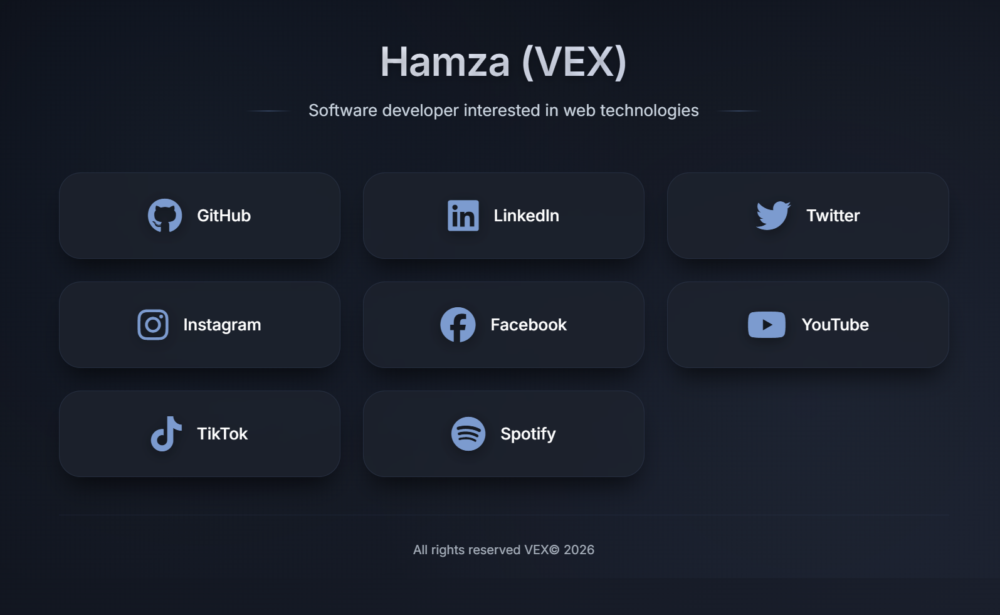

# LinkGrid 🌐

A modern, lightning-fast, and fully customizable **link-in-bio** solution built with cutting-edge JavaScript (ES6+), CSS3, and HTML5. Designed for developers, creators, and professionals who want a stylish, performant, and self-hosted page to showcase their social links, portfolio, or contact info. With a **dark, eye-friendly theme** and smooth animations – ready to be dropped into your CV or personal website.

[](https://opensource.org/licenses/MIT)


---

## ✨ Features

- **Dark & Calm Aesthetic** – Carefully chosen color palette reduces eye strain, with subtle glass‑morphism effects.
- **Fully Responsive** – Looks great on mobile, tablet, and desktop.
- **Profile Avatar Support** – Optional circular profile image with a professional glow frame.
- **Easy Customization** – Update your links, icons, and personal info in seconds via a `links.json` file.
- **Modern JavaScript (ES6+)** – Uses `async/await`, `fetch`, modules, and dynamic DOM rendering.
- **Smooth Animations** – Staggered fade‑ins, hover effects, and a toast notification system.
- **Accessibility Friendly** – Respects `prefers-reduced-motion` and includes focus states.
- **No Build Step** – Pure HTML, CSS, JS – works out of the box with any static server.
- **Self-Hosted & Free** – No tracking, no watermarks, no subscription. You own your data.

---

## 🆚 Why LinkGrid? (vs. other link-in-bio tools)

| Feature | LinkGrid | Linktree | Bio.link | Carrd |
|---------|----------|----------|----------|-------|
| **Self-hosted** | ✅ You own everything | ❌ Third‑party service | ❌ Third‑party service | ❌ Hosted on their platform |
| **Performance** | ⚡ < 50ms load time | 🐢 Heavy tracking | 🐑 Average | 🐇 Depends on plan |
| **Customization** | 🎨 Unlimited (CSS variables) | 🎨 Limited | 🎨 Basic | 🎨 Requires code |
| **Price** | 💸 **Free forever** | 💸 Freemium / Pro | 💸 Freemium | 💸 Starts at $9/year |
| **Watermark** | 🚫 None | ⚠️ On free plan | ⚠️ On free plan | ⚠️ On free plan |
| **Open Source** | 🌟 Yes (MIT) | ❌ Closed | ❌ Closed | ❌ Closed |

---

## 🚀 Live Demo

👉 [View Live Demo](https://vexlinks.vercel.app)

---

## 📸 Screenshot

<div align="center">
  
</div>

---

## 🛠️ Technologies Used

- **HTML5** – Semantic structure.
- **CSS3** – Custom properties, Flexbox, Grid, animations, media queries.
- **JavaScript (ES6+)** – Modules, Fetch API, Promises, DOM manipulation.
- **Font Awesome 6** – Icon library (v6.7.2).
- **Google Fonts (Inter)** – Clean, modern typography.

---

## 📦 Getting Started

### Prerequisites

- A modern web browser.
- A local development server (e.g., [Live Server](https://marketplace.visualstudio.com/items?itemName=ritwickdey.LiveServer) for VS Code) – required because `fetch` works over `http://`, not `file://`.

### Installation

1. **Clone the repository**

```bash
git clone https://github.com/VEX-SL/linkgrid.git
cd linkgrid
```

2. **Open with a local server**

If you use VS Code, right‑click `index.html` and select **Open with Live Server**.

Or run a simple Python server:

```bash
python3 -m http.server 8000
```

Then visit `http://localhost:8000`.

---

## 🎨 Customization Guide

### 1. Personal Information (Name & Bio)

Edit the `index.html` file:

```html
<h1 class="name">Your Name</h1>
<p class="bio">Your short bio or tagline</p>
```

---

### 2. 🖼️ Profile Picture (Avatar)

By default, the profile image is **disabled**. Follow these steps to enable and customize it.

#### Step 1 – Add your image file

Place your profile photo in the root of the project folder and name it `profile.jpg` (or any name you prefer):

```
linkgrid/
├── profile.jpg   ← your photo goes here
├── index.html
├── style.css
...
```

> Recommended: a square image (e.g. 300×300px or larger) for best results with the circular crop.

#### Step 2 – Uncomment the avatar HTML in `index.html`

Locate the commented-out block inside `<header>` and uncomment it:

```html
<!-- BEFORE (disabled) -->
<!-- <div class="profile-avatar">
    
</div> -->

<!-- AFTER (enabled) -->
<div class="profile-avatar">
    
</div>
```

> Change `alt="Your Name"` to your actual name for better accessibility.

#### Step 3 – (Optional) Customize the avatar appearance in `style.css`

The avatar styling lives under the `.profile-avatar` and `.profile-avatar img` selectors. Here are the most useful tweaks:

```css
/* Change the avatar size */
.profile-avatar img {
    width: 110px;   /* ← increase or decrease */
    height: 110px;  /* ← keep equal to width for a circle */
}

/* Change the glow ring color */
:root {
    --accent: #5f7caf;       /* ring color */
    --accent-light: #7c9bcf; /* hover ring color */
}

/* Change the spacing between the avatar and the name */
.profile-avatar {
    margin-bottom: 1.8rem; /* ← adjust as needed */
}
```

#### Step 4 – (Optional) Enable avatar click interaction

In `script.js`, there is a commented-out block that shows a toast message when the avatar is clicked:

```js
// Uncomment to enable:
const avatar = document.querySelector('.profile-avatar img');
if (avatar) {
    avatar.addEventListener('click', () => {
        showToast('This is my avatar. ✨', 1500);
    });
}
```

#### Full Avatar Example

After enabling, your `<header>` in `index.html` should look like this:

```html
<header>
    <div class="profile-avatar">
        
    </div>
    <h1 class="name">Ahmed Al-Rashidi</h1>
    <p class="bio">Full-Stack Developer · Open Source Enthusiast</p>
</header>
```

---

### 3. Links & Icons

All links are stored in `links.json`. Open it and modify the array:

```json
[
    {
        "name": "GitHub",
        "url": "https://github.com/yourusername",
        "icon": "fa-brands fa-github"
    },
    {
        "name": "LinkedIn",
        "url": "https://linkedin.com/in/yourusername",
        "icon": "fa-brands fa-linkedin"
    }
]
```

- `name` – Display name of the platform.
- `url` – Full URL (including `https://`). For email, use `mailto:you@example.com`.
- `icon` – Font Awesome 6 icon class. Find icons at [fontawesome.com/icons](https://fontawesome.com/icons).

> **Note:** Icons like `fa-brands fa-x-twitter` (X/Twitter) and `fa-brands fa-signal-messenger` (Signal) are fully supported in Font Awesome 6.7.2+.

---

### 4. Colors & Theme

The color scheme is controlled by CSS variables inside `:root` in `style.css`:

```css
:root {
    --bg-gradient-start: #0b0f17;
    --bg-gradient-end: #1a1f2c;
    --accent: #5f7caf;
    --accent-light: #7c9bcf;
    --text-primary: #ffffff;
    --text-secondary: #cbd5e0;
}
```

---

### 5. Animations & Effects

- **Animation speeds** – Adjust `transition` and `animation` durations in the CSS.
- **Hover effects** – Modify the `.link-card:hover` rules.
- **Toast notifications** – Change the `showToast` function in `script.js`.

---

## 📁 Project Structure

```
linkgrid/
├── favicon.png         # Site icon
├── index.html          # Main HTML file
├── style.css           # All styles (dark theme, animations)
├── script.js           # JavaScript logic (fetch, render, toast)
├── links.json          # Your links data (easy to edit)
├── profile.jpg         # Your profile photo (optional, add manually)
├── screenshots/        # Folder for screenshots
└── README.md           # This file
```

---

## 🔧 Advanced Customization

### Using Local Storage as a Mini‑CMS

If you want to add/edit links directly from the browser, you can enable the built‑in admin panel:

1. Uncomment the HTML for the "Add Link" button and modal in `index.html`.
2. Uncomment the corresponding CSS in `style.css` (the `.add-btn`, `.modal`, `.delete-btn` sections).
3. Uncomment the JavaScript code at the bottom of `script.js` (the admin panel section).

> ⚠️ **Security Warning:** The admin panel runs entirely on the client side. Any visitor to your site can add, edit, or delete links. Only enable it for local testing. For production, edit `links.json` directly and redeploy.

### Hosting on GitHub Pages

1. Push the project to a GitHub repository.
2. Go to **Settings → Pages**.
3. Select the `main` branch and `/root` folder.
4. Your site will be live at `https://yourusername.github.io/linkgrid/`.

---

## 🤝 Contributing

Contributions, issues, and feature requests are welcome!  
Feel free to check the [issues page](https://github.com/VEX-SL/linkgrid/issues).

1. Fork the project.
2. Create your feature branch (`git checkout -b feature/AmazingFeature`).
3. Commit your changes (`git commit -m 'Add some amazing feature'`).
4. Push to the branch (`git push origin feature/AmazingFeature`).
5. Open a Pull Request.

---

## 📄 License

Distributed under the MIT License. See `LICENSE` for more information.

---

## 📬 Contact

VEX – [X (Twitter)](https://x.com/Ha1Hany2) – [Email](hamzaowad1713@gmail.com)

Project Link: [https://github.com/VEX-SL/linkgrid](https://github.com/VEX-SL/linkgrid)

---

<p align="center">Made with ❤️ and JavaScript</p>
