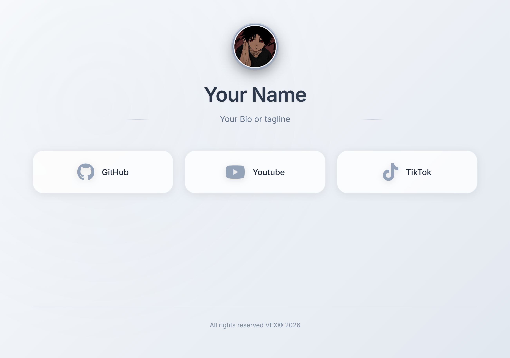
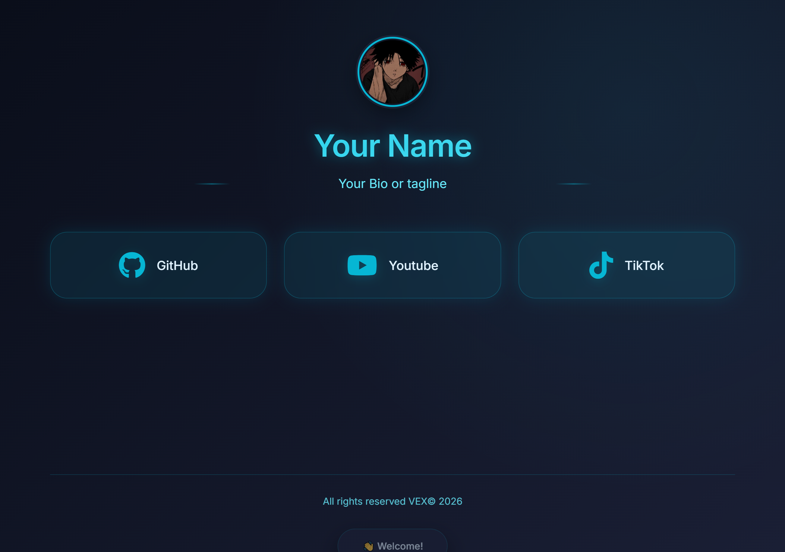
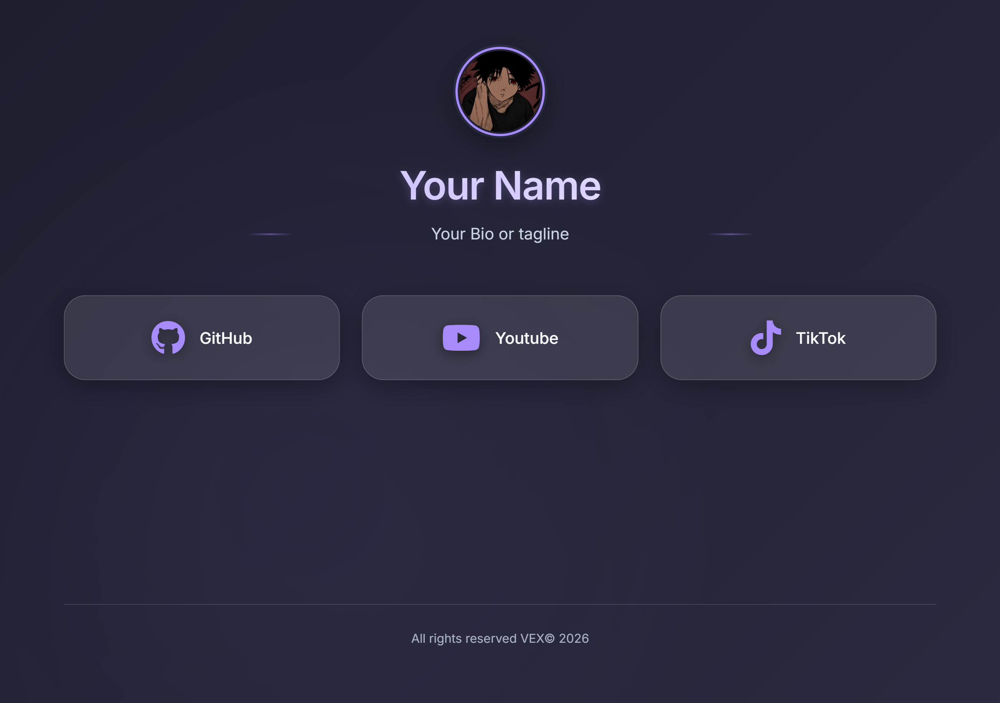
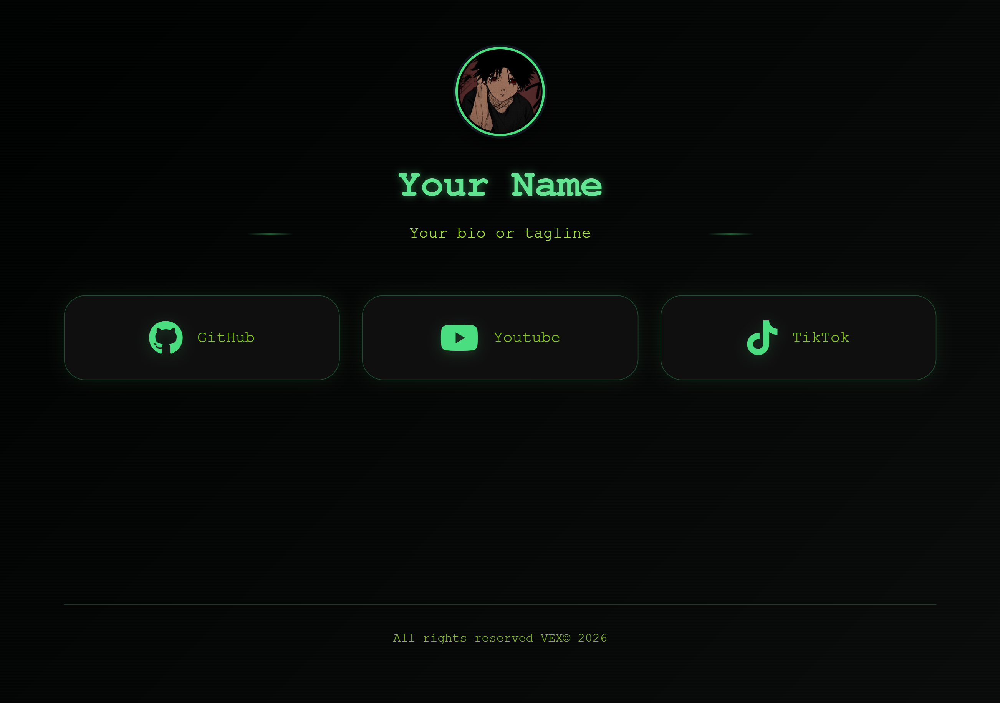
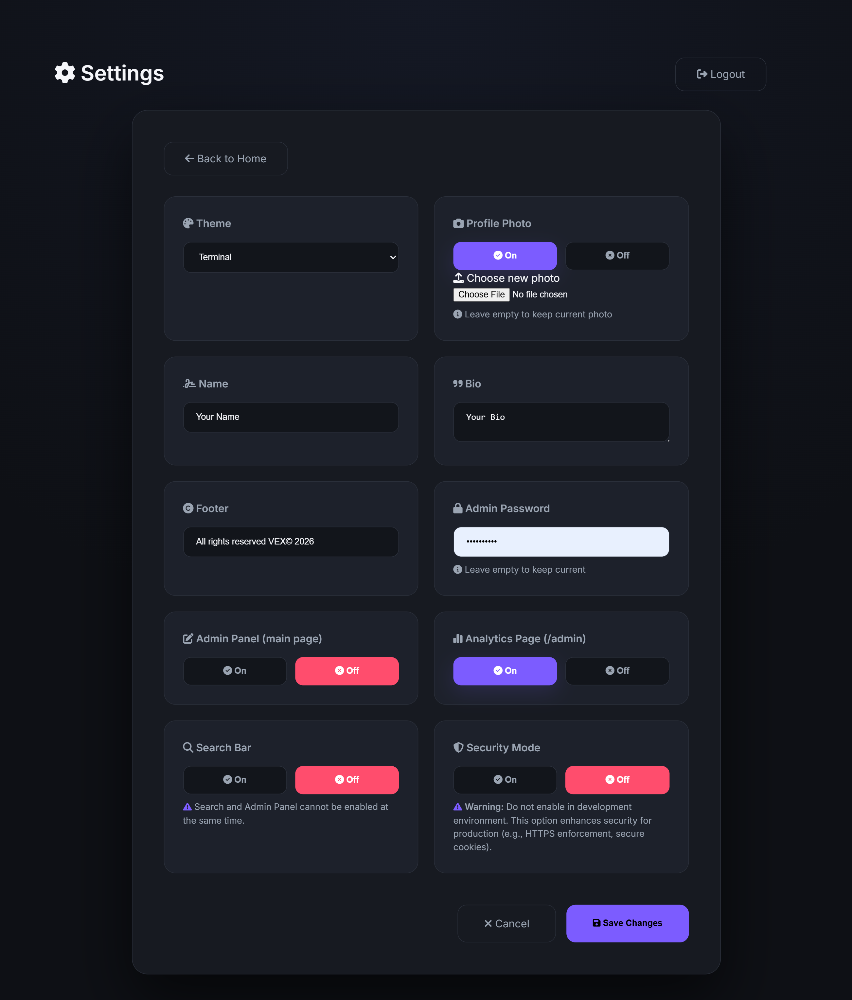
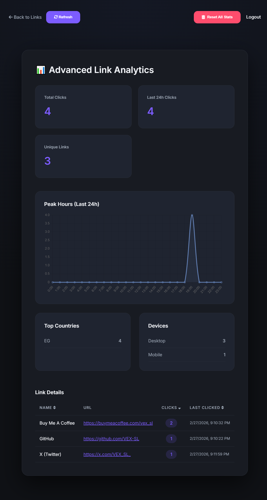
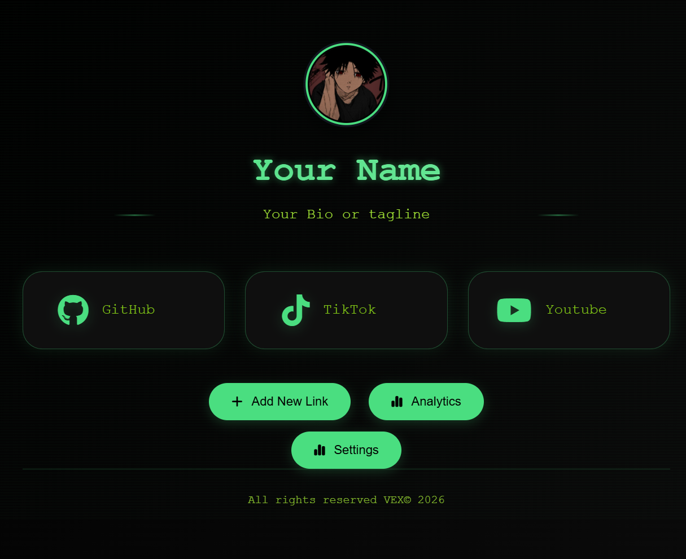
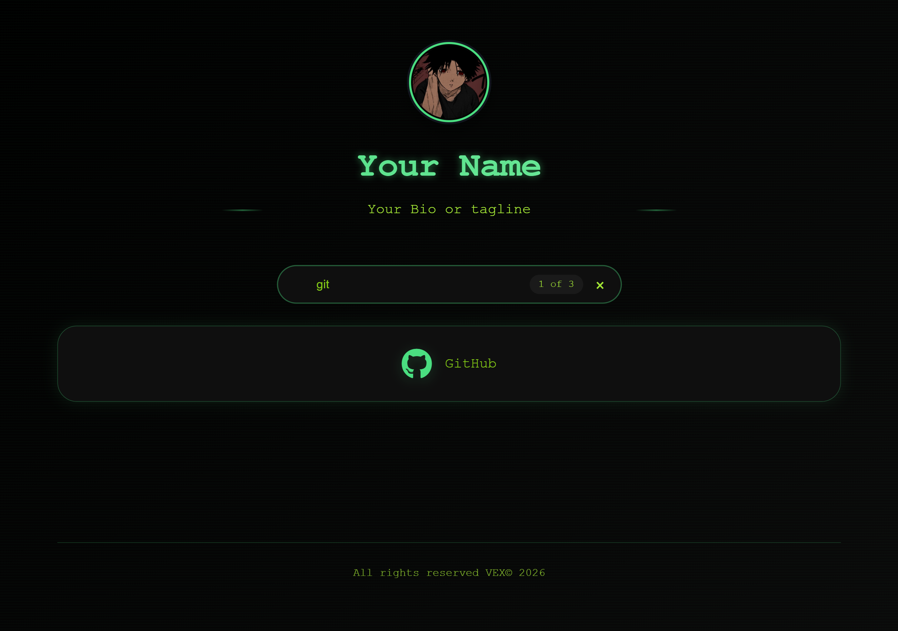

# 🌐 LinkGrid

<div align="center">
  

  ### A Modern Self-Hosted Link-in-Bio Platform
  
  **Beautiful • Fast • Full Control**

  
  
  
  
  

  [Live Demo](https://vexlinks.vercel.app) • [Report Bug](https://github.com/VEX-SL/linkgrid/issues) • [Request Feature](https://github.com/VEX-SL/linkgrid/issues)
</div>

---

## 🚀 What is LinkGrid?

LinkGrid is a **fully self-hosted, production-ready** alternative to commercial link-in-bio platforms like Linktree and Bio.link.

**Designed for:**
- 👨‍💻 Developers
- 🎨 Creators
- 🏢 Agencies
- 🔒 Privacy-focused users
- 💼 SaaS builders

**You own:**
- ✅ Your data
- ✅ Your analytics
- ✅ Your hosting
- ✅ Your infrastructure

**No third-party tracking. No recurring fees. No vendor lock-in.**

---

## ✨ Feature Highlights

| Feature | Description |
|---------|-------------|
| 🎨 **5 Built-in Themes** | Minimal, Cyber, Glass, Terminal, Elegant |
| ⚙️ **Web-Based Settings** | Configure everything from `/settings` page — no code needed |
| 📊 **Built-in Analytics** | Track clicks, countries, devices, and hourly activity from `/admin` |
| 🔍 **Live Search** | Instant filtering with result count |
| 🖱️ **Drag & Drop Links** | Reorder your links easily from the admin panel |
| 🖼️ **Automatic Favicons** | Icons are fetched automatically from websites |
| 🚀 **Blazing Fast** | Pure vanilla JS, no heavy frameworks |
| 📱 **Fully Responsive** | Looks perfect on any device |
| ♿ **Accessibility Ready** | Respects `prefers-reduced-motion`, keyboard navigation |
| 🔓 **MIT Licensed** | Free for personal and commercial use |

---

## 🆚 LinkGrid vs. Competitors

### Comparison with Other Platforms

| Feature | LinkGrid | Linktree | Bio.link | Carrd |
|---------|----------|----------|----------|-------|
| **Hosting Model** | ✅ Self-hosted | ❌ SaaS only | ❌ SaaS only | ❌ Hosted platform |
| **Data Ownership** | ✅ Full control | ⚠️ Platform-owned | ⚠️ Platform-owned | ⚠️ Platform-owned |
| **Analytics** | ✅ Self-controlled | 📊 Third-party scripts | 📊 Platform analytics | 📊 Limited (paid) |
| **Customization** | ✅ Full CSS control | 🎨 Template-based | 🎨 Basic only | 🎨 Flexible (complex) |
| **Backend Access** | ✅ Full access | ❌ No access | ❌ No access | ❌ No access |
| **Performance** | ⚡ Lightweight | ⚠️ External scripts | ⚠️ External scripts | ⚠️ Varies |
| **Pricing** | 💸 Free (MIT) | 💸 Freemium | 💸 Freemium | 💸 Paid plans |
| **Branding** | 🚫 None | ⚠️ Free tier branding | ⚠️ Free tier branding | ⚠️ Free tier branding |
| **Open Source** | ✅ Yes | ❌ No | ❌ No | ❌ No |
| **Monthly Fees** | ✅ None | ❌ Yes | ❌ Yes | ❌ Yes |

### Key Advantages

- **Full Backend Control** — Extend, modify, and customize everything
- **Own Your Analytics** — No external tracking scripts
- **No SaaS Lock-in** — Export your data anytime
- **Privacy-First** — Your data never leaves your server
- **Developer-Friendly** — Clean codebase, easy to extend

---

## 📸 Screenshots

### 🌙 Elegant Theme (Default)


### 🎨 Themes Preview

| Minimal | Cyber | Glass | Terminal |
|---------|--------|--------|----------|
|  |  |  |  |
---

| Settings Page | Admin Page | Admin Panel | Drag & Drop Reorder | Live Search |
|---------|--------|--------|--------|----------|
|  |  |  |  |  |
---

## 🚀 Quick Start

### 📦 Installation

**Requirements:** Node.js 18+

```bash
git clone https://github.com/VEX-SL/linkgrid.git
cd linkgrid
npm install
npm start
```

**Access your site:** Open [http://localhost:3125](http://localhost:3125)

---

## ⚙️ Initial Setup

### 🔐 First Login

1. Go to **`http://localhost:3125/admin`**
2. Login with the default password: **`admin`**
3. **Important:** Change your password immediately from the settings page!

---

### 🎨 Configure Your Profile

Visit **`http://localhost:3125/settings`** to customize:

- **Theme** — Choose from 5 beautiful themes
- **Profile Photo** — Upload your picture
- **Name & Bio** — Your personal information
- **Footer Text** — Customize the footer
- **Search** — Enable/disable live search
- **Password** — Change your admin password

**Everything is managed from the web interface — no coding required!**

---

### 🔗 Managing Your Links

From the **`/admin`** page, you can:

- ➕ Add new links
- ✏️ Edit existing links
- 🗑️ Delete links
- 🖱️ Drag & drop to reorder
- 📊 View click statistics

---

## 🔒 Security

### Password Management

**Default password:** `admin`

**⚠️ CRITICAL:** Change the default password immediately after first login!

**To change your password:**
1. Go to `/settings`
2. Enter your new password
3. Save

**Forgot your password?**

If you forget your password, you can retrieve it from:
- **File location:** `public/data/settings.json`
- Look for the `"adminPassword"` field
- You can edit this file directly to reset your password

**Security Best Practices:**
- ✅ Use a strong, unique password
- ✅ Enable HTTPS in production
- ✅ Don't share your admin link publicly
- ✅ Regularly backup your data

---

## 📊 Analytics Dashboard

Visit **`/admin`** to see:

- ✅ **Total clicks** across all links
- 📈 **Per-link statistics** with last click time
- 🌍 **Top countries** where your visitors are from
- 📱 **Device breakdown** (Desktop, Mobile, Tablet)
- ⏰ **Hourly activity** chart

**All analytics are stored locally** — no third-party tracking services!

---

## 📁 Project Structure

```
linkgrid/
├── index.js                # Express server (backend)
├── package.json            # Node.js dependencies
├── public/
│   ├── index.html          # Main page
│   ├── admin.html          # Analytics dashboard
│   ├── settings.html       # Settings page
│   ├── style.css           # All themes & styles
│   ├── script.js           # Frontend logic
│   ├── profile.jpg         # Your profile photo
│   ├── favicon.png         # Site favicon
│   └── data/
│       ├── settings.json   # Your configuration
│       ├── links.json      # Your links
│       └── statistics.json # Auto-generated analytics
└── screenshots/            # For README
```

---

## 🌐 Deployment

### Cloud Platforms (Railway / Render / Heroku)

1. Push your repository to GitHub
2. Connect to your platform (Railway/Render/Heroku)
3. The platform will automatically detect and deploy
4. Set start command: `node index.js`
5. Done! 🎉

---

### VPS / Self-Hosted (Recommended)

**Using PM2 for Process Management:**

```bash
npm install -g pm2
pm2 start index.js --name linkgrid
pm2 save
pm2 startup
```

**Recommended Production Setup:**
- ✅ NGINX reverse proxy
- ✅ HTTPS (Let's Encrypt)
- ✅ Firewall rules
- ✅ Regular backups

---

## 🏗️ System Architecture

**For Developers:** Technical deep-dive into how LinkGrid works.

### Frontend Layer

- **Pure Stack:** HTML / CSS / JavaScript (Vanilla, no frameworks)
- **Theming:** CSS Variables — all themes defined in `style.css`
- **Dynamic Rendering:** `index.html` fetches data via JavaScript

**Favicon Auto-fetch:** Icons are automatically fetched from `icons.duckduckgo.com`

**Live Search:** Real-time filtering of links

**Drag & Drop:** Implemented with SortableJS

---

### Backend Layer

- **Server:** Node.js + Express
- **Storage:** JSON files in `public/data/`
  - `settings.json` — User configuration
  - `links.json` — List of links
  - `statistics.json` — Auto-generated analytics

**Analytics Pipeline:**
1. User clicks a link
2. Frontend sends `POST /api/click`
3. Server extracts IP, geolocation, device type
4. Server updates `statistics.json`

**Admin Authentication:** Session-based using `express-session`

---

### Data Flow

```
┌─────────────┐       ┌─────────────────┐       ┌─────────────────┐
│   Browser   │  ───► │   Express API   │  ───► │   JSON Files    │
│(index.html) │       │   (index.js)    │       │ (public/data/)  │
└─────────────┘       └─────────────────┘       └─────────────────┘
       ▲                                                   │
       └───────────────────────────────────────────────────┘
                        (static files)
```

---

### Design Principles

- ⚡ **Minimal dependencies** — No heavy frameworks
- 🚀 **High performance** — Lightweight runtime
- 🔧 **Easy extensibility** — Clean, modular code
- 📊 **Transparent data flow** — Simple to understand and modify

---

## 📈 Performance Philosophy

LinkGrid is designed for **speed and efficiency**:

- ⚡ Lightweight runtime
- 📦 No heavy framework bundles
- 💾 Minimal memory footprint
- 🚀 Fast initial paint
- ⚙️ Efficient event handling

**Scales vertically** — Perfect for VPS deployment.

---

## 🛣️ Roadmap

- [x] Multi-theme system
- [x] Web-based settings page
- [x] Admin analytics dashboard
- [x] Profile avatar
- [x] Drag & drop reorder
- [x] Live search
- [x] Automatic favicons
- [ ] **Theme builder** (custom CSS editor)
- [ ] **Import / Export** links
- [ ] **Docker support**
- [ ] **Multi-user system**
- [ ] **Role-based access control**
- [ ] **Database mode** (MongoDB / PostgreSQL)
- [ ] **API key system**
- [ ] **Webhook support**
- [ ] **Custom domain manager**
- [ ] **Plugin system**

---

## 🧩 Extending LinkGrid

**For Developers:** LinkGrid is designed for modification. You can:

- 🔄 Replace JSON storage with a database
- 🎨 Create custom themes
- 🔌 Add middleware
- 📊 Build custom analytics dashboards
- 🌐 Integrate external APIs

**Developer-first architecture** — easy to extend and customize.

---

## ⚠️ Important Notes

1. **Change Default Password:** The default password is `admin` — change it immediately from `/settings`!

2. **Privacy Compliance:** The analytics system records IP addresses (to determine country). Be aware of privacy regulations (GDPR, CCPA).

3. **Backup Your Data:** Regularly backup the `public/data/` folder — it contains all your settings, links, and analytics.

4. **HTTPS in Production:** Always use HTTPS when deploying publicly to protect your admin password.

---

## 🤝 Contributing

Contributions are what make the open-source community amazing! Any contributions you make are **greatly appreciated**.

1. Fork the repository
2. Create a feature branch: `git checkout -b feature/amazing-feature`
3. Commit your changes: `git commit -m 'Add amazing feature'`
4. Push to the branch: `git push origin feature/amazing-feature`
5. Open a Pull Request

**Guidelines:**
- Follow clean code principles
- Avoid unnecessary dependencies
- Performance-first mindset
- Write clear commit messages

---

## 📜 License

**MIT License** — Free for personal and commercial use.

See [LICENSE](LICENSE) for more information.

---

## ☕ Support the Project

If you like LinkGrid, consider supporting development:

[](https://buymeacoffee.com/vex_sl)

⭐ **Star the repository** — it helps others discover LinkGrid!

---

## 📬 Contact

**VEX** – [@VEX_SL_](https://x.com/VEX_SL_) – hamzaowad1713@gmail.com

**Project Link:** [https://github.com/VEX-SL/linkgrid](https://github.com/VEX-SL/linkgrid)

---

<div align="center">
  
  **Made with ❤️ and JavaScript**
  
  ⭐ Star us on GitHub — it helps!

</div>
