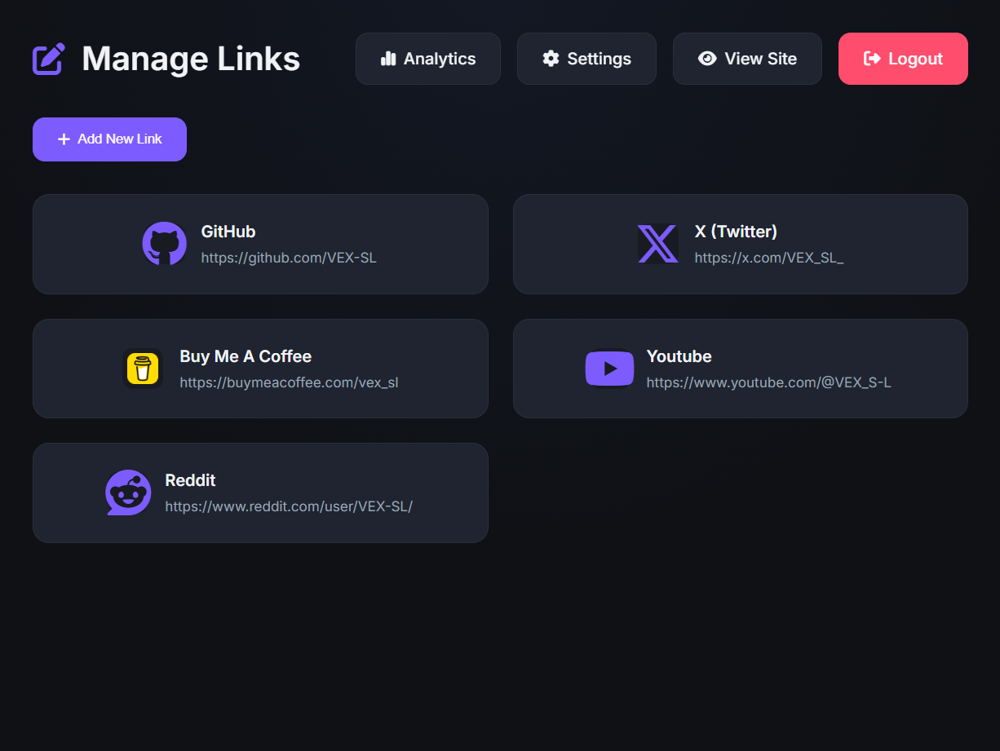

# 🌐 LinkGrid

<div align="center">
  

  ### A Modern Self-Hosted Link-in-Bio Platform
  
  **Beautiful • Fast • Full Control**

  
  
  
  
  

  [Live Demo](https://links--vex-sl.replit.app/) • [Report Bug](https://github.com/VEX-SL/linkgrid/issues) • [Request Feature](https://github.com/VEX-SL/linkgrid/issues)
</div>

---

## 📖 Table of Contents

- [What is LinkGrid?](#-what-is-linkgrid)
- [Feature Highlights](#-feature-highlights)
- [LinkGrid vs Competitors](#-linkgrid-vs-competitors)
- [Screenshots](#-screenshots)
- [Quick Start](#-quick-start)
- [Initial Setup](#️-initial-setup)
- [Managing Links](#️-managing-links-admin-interface)
- [Cloud Storage (Optional)](#️-cloud-storage-optional)
- [Analytics Dashboard](#-analytics-dashboard)
- [Security](#-security)
- [Project Structure](#-project-structure)
- [Deployment](#-deployment)
- [System Architecture](#️-system-architecture)
- [Performance Philosophy](#-performance-philosophy)
- [Roadmap](#️-roadmap)
- [Extending LinkGrid](#-extending-linkgrid)
- [Important Notes](#️-important-notes)
- [Contributing](#-contributing)
- [License](#-license)
- [Support](#-support-the-project)
- [Contact](#-contact)

---

## 🚀 What is LinkGrid?

LinkGrid is a **fully self-hosted, production-ready** alternative to commercial link-in-bio platforms like Linktree and Bio.link.

### Designed for:
- 👨‍💻 **Developers** — Full backend control and customization
- 🎨 **Creators** — Beautiful themes without coding
- 🏢 **Agencies** — White-label solution for clients
- 🔒 **Privacy-focused users** — Your data stays yours
- 💼 **SaaS builders** — Foundation for link management products

### You Own:
- ✅ Your data
- ✅ Your analytics
- ✅ Your hosting
- ✅ Your infrastructure

**No third-party tracking. No recurring fees. No vendor lock-in.**

---

## ✨ Feature Highlights

| Feature | Description |
|---------|-------------|
| 🎨 **5 Built-in Themes** | Minimal, Cyber, Glass, Terminal, Elegant |
| ⚙️ **Web-Based Settings** | Configure everything from `/settings` page — no code needed |
| 📊 **Built-in Analytics** | Track clicks, countries, devices, and hourly activity from `/admin` |
| 🔍 **Live Search** | Instant filtering with result count |
| 🖱️ **Dedicated Links Manager** | Separate protected page (`/links`) for full CRUD and drag & drop |
| 🖼️ **Automatic Favicons** | Icons are fetched automatically from websites |
| 🔐 **Secure Authentication** | Passwords hashed with bcrypt, session-based login |
| ☁️ **Cloud Storage Ready** | Use JSONbin.io for persistent data on ephemeral platforms |
| 🚀 **Blazing Fast** | Pure vanilla JS, no heavy frameworks |
| 📱 **Fully Responsive** | Looks perfect on any device |
| ♿ **Accessibility Ready** | Respects `prefers-reduced-motion`, keyboard navigation |
| 🔓 **MIT Licensed** | Free for personal and commercial use |

---

## 🆚 LinkGrid vs Competitors

### Comparison with Other Platforms

| Feature | LinkGrid | Linktree | Bio.link | Carrd |
|---------|----------|----------|----------|-------|
| **Hosting Model** | ✅ Self-hosted | ❌ SaaS only | ❌ SaaS only | ❌ Hosted platform |
| **Data Ownership** | ✅ Full control | ⚠️ Platform-owned | ⚠️ Platform-owned | ⚠️ Platform-owned |
| **Analytics** | ✅ Self-controlled | 📊 Third-party scripts | 📊 Platform analytics | 📊 Limited (paid) |
| **Customization** | ✅ Full CSS control | 🎨 Template-based | 🎨 Basic only | 🎨 Flexible (complex) |
| **Backend Access** | ✅ Full access | ❌ No access | ❌ No access | ❌ No access |
| **Performance** | ⚡ Lightweight | ⚠️ External scripts | ⚠️ External scripts | ⚠️ Varies |
| **Pricing** | 💸 Free (MIT) | 💸 Freemium | 💸 Freemium | 💸 Paid plans |
| **Branding** | 🚫 None | ⚠️ Free tier branding | ⚠️ Free tier branding | ⚠️ Free tier branding |
| **Open Source** | ✅ Yes | ❌ No | ❌ No | ❌ No |
| **Monthly Fees** | ✅ None | ❌ Yes | ❌ Yes | ❌ Yes |

### Key Advantages

- **Full Backend Control** — Extend, modify, and customize everything
- **Own Your Analytics** — No external tracking scripts
- **No SaaS Lock-in** — Export your data anytime
- **Privacy-First** — Your data never leaves your server
- **Developer-Friendly** — Clean codebase, easy to extend

---

## 📸 Screenshots

### 🌙 Elegant Theme (Default)


### 🎨 Themes Preview

| Minimal | Cyber | Glass | Terminal |
|---------|--------|--------|----------|
|  |  |  |  |

### 🖥️ Admin Interface

| Settings Page | Analytics Dashboard | Links Manager | Live Search |
|---------------|---------------------|---------------|-------------|
|  |  |  |  |

> **Note:** The new dedicated `/links` page provides a clean, protected interface for managing your links, separate from the public view.

---

## 🚀 Quick Start

### 📦 Installation

**Requirements:** Node.js 18+

```bash
# Clone the repository
git clone https://github.com/VEX-SL/linkgrid.git

# Navigate to directory
cd linkgrid

# Install dependencies
npm install

# Start the server
npm start
```

**Access your site:** Open [http://localhost:3000](http://localhost:3000)

---

## ⚙️ Initial Setup

### 🔐 First Login

1. Navigate to **`http://localhost:3000/admin`** (or any protected page)
2. Login with the default password: **`admin`**
3. **⚠️ CRITICAL:** Change your password immediately from the settings page!

### 🎨 Configure Your Profile

Visit **`http://localhost:3000/settings`** to customize:

- **Theme** — Choose from 5 beautiful themes
- **Profile Photo** — Upload your picture
- **Name & Bio** — Your personal information
- **Footer Text** — Customize the footer
- **Search** — Enable/disable live search
- **Password** — Change your admin password

**Everything is managed from the web interface — no coding required!**

---

## 🖱️ Managing Links (Admin Interface)

LinkGrid now features a **dedicated, protected page** for link management: `/links`.

### Accessing the Links Manager

1. Go to **`http://your-site.com/links`**
2. Log in with your admin password (shared across `/admin`, `/settings`, `/links`)

### Features of `/links` Page

- ✅ **Full CRUD** — Create, read, update, delete links
- ✅ **Drag & Drop** — Reorder links instantly with visual feedback
- ✅ **Automatic Favicons** — See icons as you type "auto"
- ✅ **Admin-style UI** — Dark theme consistent with `/admin` and `/settings`
- ✅ **Separate from public view** — No risk of accidental edits while visitors browse

---

## ☁️ Cloud Storage (Optional)

If you deploy on platforms with ephemeral storage (like Replit, Glitch, etc.), you must use JSONbin.io to persist your data permanently.

### 📋 JSONbin.io Setup

We've created a dedicated page that contains all the JSON code you need — ready to copy & paste.

👉 **Visit the preparation page:** [https://links--vex-sl.replit.app/prepare](https://links--vex-sl.replit.app/prepare)

This page includes:

- ✅ The exact JSON for Settings, Links, and Statistics bins
- ✅ Step-by-step instructions for creating bins on JSONbin.io
- ✅ Copy buttons for each JSON block (no manual typing!)
- ✅ All required environment variables explained

### Quick Setup Steps:

1. Create a free account at [jsonbin.io](https://jsonbin.io)
2. Get your API Key from the dashboard
3. Use our prep page to copy and create three bins:
   - **Settings bin** — paste the settings JSON
   - **Links bin** — paste the links JSON
   - **Statistics bin** — paste the empty stats structure
4. Copy each bin's ID

### Environment Variables

Create a `.env` file (or set environment variables in your hosting platform):

```env
NODE_ENV=production
SESSION_SECRET=your-strong-random-string-64-chars
JSONBIN_KEY=your-jsonbin-master-key
SETTINGS_BIN_ID=your-settings-bin-id
LINKS_BIN_ID=your-links-bin-id
STATS_BIN_ID=your-stats-bin-id
```

The app will automatically use JSONbin for all data storage if these variables are set.

---

## 📊 Analytics Dashboard

Visit **`/admin`** to see:

- ✅ **Total clicks** across all links
- 📈 **Per-link statistics** with last click time
- 🌍 **Top countries** where your visitors are from
- 📱 **Device breakdown** (Desktop, Mobile, Tablet)
- ⏰ **Hourly activity** chart

**All analytics are stored locally (or in JSONbin) — no third-party tracking services!**

---

## 🔒 Security

### Password Management

**Default password:** `admin`

**⚠️ CRITICAL:** Change the default password immediately after first login!

#### To Change Your Password:

1. Go to `/settings`
2. Enter your new password in the "Admin Password" field
3. Save

The password is hashed using **bcrypt** before storage.

#### Forgot Your Password?

If you forget your password, you can:

1. Check your JSONbin settings bin (if using cloud storage)
2. Or reset it manually in `public/data/settings.json` (local storage)
3. After reset, go to `/settings` and set a new password

### Security Best Practices:

- ✅ Use a strong, unique password
- ✅ Enable HTTPS in production
- ✅ Don't share your admin links publicly
- ✅ Regularly backup your data
- ✅ Set `SESSION_SECRET` to a long random string

---

## 📁 Project Structure

```
linkgrid/
├── index.js                # Express server (backend)
├── package.json            # Node.js dependencies
├── public/
│   ├── index.html          # Main public page
│   ├── admin.html          # Analytics dashboard
│   ├── settings.html       # Settings page
│   ├── admin-links.html    # Dedicated links manager page
│   ├── prepare.html        # Prep page for JSONbin setup
│   ├── style.css           # All themes & styles
│   ├── script.js           # Frontend logic
│   ├── profile.jpg         # Your profile photo
│   ├── favicon.png         # Site favicon
│   └── data/               # Local storage (when not using JSONbin)
│       ├── settings.json
│       ├── links.json
│       └── statistics.json
└── screenshots/            # For README
```

---

## 🌐 Deployment

### Cloud Platforms (Railway / Render / Heroku)

1. Push your repository to GitHub
2. Connect to your platform (Railway/Render/Heroku)
3. Set environment variables as needed
4. Set start command: `node index.js`
5. Done! 🎉

**For ephemeral platforms (Replit, Glitch, etc.) — must use JSONbin.io for persistent storage.**

### VPS / Self-Hosted (Recommended)

#### Using PM2 for Process Management:

```bash
# Install PM2 globally
npm install -g pm2

# Start LinkGrid with PM2
pm2 start index.js --name linkgrid

# Save PM2 configuration
pm2 save

# Setup PM2 to start on system boot
pm2 startup
```

#### Recommended Production Setup:

- ✅ NGINX reverse proxy
- ✅ HTTPS (Let's Encrypt)
- ✅ Firewall rules
- ✅ Regular backups of `public/data/`

---

## 🏗️ System Architecture

**For Developers:** Technical deep-dive into how LinkGrid works.

### Frontend Layer

- **Pure Stack:** HTML / CSS / JavaScript (Vanilla, no frameworks)
- **Theming:** CSS Variables — all themes defined in `style.css`
- **Dynamic Rendering:** `index.html` fetches data via JavaScript
- **Favicon Auto-fetch:** Icons are automatically fetched from `icons.duckduckgo.com`
- **Live Search:** Real-time filtering of links
- **Drag & Drop:** Implemented with SortableJS

### Backend Layer

- **Server:** Node.js + Express
- **Storage:** JSON files (local) OR JSONbin.io (cloud)
- **Analytics Pipeline:**
  1. User clicks a link
  2. Frontend sends `POST /api/click`
  3. Server extracts IP, geolocation (via ip-api.com + geoip-lite), device type
  4. Server updates statistics (local file or JSONbin)
- **Admin Authentication:** Session-based using `express-session` with bcrypt password hashing

#### Environment Variables:

- `NODE_ENV` — production or development
- `SESSION_SECRET` — secret for session encryption
- `JSONBIN_KEY`, `*_BIN_ID` — for cloud storage

### Data Flow (Local Storage)

```
┌─────────────┐       ┌─────────────────┐       ┌─────────────────┐
│   Browser   │  ───► │   Express API   │  ───► │   JSON Files    │
│(index.html) │       │   (index.js)    │       │ (public/data/)  │
└─────────────┘       └─────────────────┘       └─────────────────┘
       ▲                                                   │
       └───────────────────────────────────────────────────┘
                        (static files)
```

### Data Flow (Cloud Storage)

```
┌─────────────┐       ┌─────────────────┐       ┌─────────────────┐
│   Browser   │  ───► │   Express API   │  ───► │   JSONbin.io    │
│(index.html) │       │   (index.js)    │       │  (Cloud API)    │
└─────────────┘       └─────────────────┘       └─────────────────┘
       ▲                                                   │
       └───────────────────────────────────────────────────┘
                        (static files)
```

### Design Principles

- ⚡ **Minimal dependencies** — No heavy frameworks
- 🚀 **High performance** — Lightweight runtime
- 🔧 **Easy extensibility** — Clean, modular code
- 📊 **Transparent data flow** — Simple to understand and modify

---

## 📈 Performance Philosophy

LinkGrid is designed for **speed and efficiency**:

- ⚡ Lightweight runtime
- 📦 No heavy framework bundles
- 💾 Minimal memory footprint
- 🚀 Fast initial paint
- ⚙️ Efficient event handling

**Scales vertically** — Perfect for VPS deployment.

---

## 🛣️ Roadmap

### ✅ Completed Features

- [x] Multi-theme system
- [x] Web-based settings page
- [x] Admin analytics dashboard
- [x] Profile avatar
- [x] Drag & drop reorder
- [x] Live search
- [x] Automatic favicons
- [x] bcrypt password hashing
- [x] JSONbin.io cloud storage integration
- [x] Dedicated links manager page (`/links`) with admin UI

### 🚧 Planned Features

- [ ] **Theme builder** (custom CSS editor)
- [ ] **Import / Export** links
- [ ] **Docker support**
- [ ] **Multi-user system**
- [ ] **Role-based access control**
- [ ] **Database mode** (MongoDB / PostgreSQL)
- [ ] **API key system**
- [ ] **Webhook support**
- [ ] **Custom domain manager**
- [ ] **Plugin system**

---

## 🧩 Extending LinkGrid

**For Developers:** LinkGrid is designed for modification. You can:

- 🔄 Replace JSON storage with a database
- 🎨 Create custom themes
- 🔌 Add middleware
- 📊 Build custom analytics dashboards
- 🌐 Integrate external APIs

**Developer-first architecture** — easy to extend and customize.

---

## ⚠️ Important Notes

1. **Change Default Password:** The default password is `admin` — change it immediately from `/settings`!

2. **Privacy Compliance:** The analytics system records IP addresses (to determine country). Be aware of privacy regulations (GDPR, CCPA).

3. **Backup Your Data:** Regularly backup your data:
   - **Local storage:** `public/data/` folder
   - **Cloud storage:** JSONbin.io dashboard

4. **HTTPS in Production:** Always use HTTPS when deploying publicly to protect your admin password and session cookies.

5. **Ephemeral Storage Platforms:** If deploying on Replit, Glitch, etc., you must use JSONbin.io for persistent data — otherwise all data will be lost on restart.

6. **Environment Variables:** Never commit `.env` file to Git. Use your hosting platform's secret management.

7. **Use Our Prep Page:** For quick JSONbin setup, visit [https://links--vex-sl.replit.app/prepare](https://links--vex-sl.replit.app/prepare) — it contains all the code you need to copy.

8. **No More AdminPanel on Main Page:** The `adminPanel` option has been completely removed. All link management now happens in the dedicated `/links` page, making the public view cleaner and safer.

---

## 🤝 Contributing

Contributions are what make the open-source community amazing! Any contributions you make are **greatly appreciated**.

### How to Contribute:

1. Fork the repository
2. Create a feature branch: `git checkout -b feature/amazing-feature`
3. Commit your changes: `git commit -m 'Add amazing feature'`
4. Push to the branch: `git push origin feature/amazing-feature`
5. Open a Pull Request

### Guidelines:

- Follow clean code principles
- Avoid unnecessary dependencies
- Performance-first mindset
- Write clear commit messages

---

## 📜 License

**MIT License** — Free for personal and commercial use.

See [LICENSE](LICENSE) for more information.

---

## ☕ Support the Project

If you like LinkGrid, consider supporting development:

[](https://buymeacoffee.com/vex_sl)

⭐ **Star the repository** — it helps others discover LinkGrid!

---

## 📬 Contact

**VEX** – [@VEX_SL_](https://x.com/VEX_SL_) – hamzaowad1713@gmail.com

**Project Link:** [https://github.com/VEX-SL/linkgrid](https://github.com/VEX-SL/linkgrid)

---

<div align="center">
  
  **Made with ❤️ and JavaScript**
  
  ⭐ Star us on GitHub — it helps!

</div>
